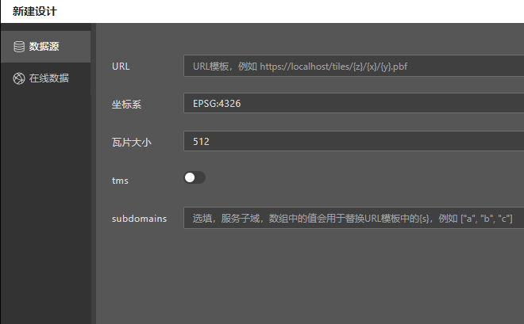

# 连接数据源

点击```新建设计```，向导面板中提供了连接各类数据源的配置选项，通过他们可以轻松的将Designer连接到矢量瓦片数据源。



## 自定义数据源

自定义数据源向导提供了连接任意数据源，所需的必要参数，其界面如下：


各项配置的说明如下：

* **URL**， URL模板，对应maptalks引擎VectorTileLayer类中```urlTemplate```配置，例如 `https://localhost/tiles/{z}/{x}/{y}.pbf`
* **坐标系**，数据源的坐标系
* **瓦片大小**，矢量瓦片的瓦片大小，512是标准矢量瓦片服务的默认尺寸，也可以选择为256
* **tms**，瓦片的组织方式是否是tms，各类遵从OGC标准的GIS数据服务常用，例如 GeoServer
* **subdomains**，选填项，当瓦片服务由多个服务地址提供时，subdomains用于设置服务子域，数组中的值用于替换URL模板中的 `{s}` 变量，例如 `["0", "1", "2"]`

## 连接GeoServer

这里以GeoServer为例，假定您已经有了geoserver托管的是矢量瓦片数据服务，如何用自定义数据源面板连接GeoServer。


