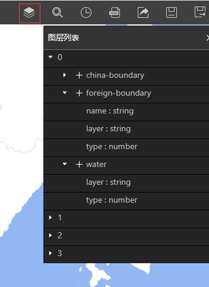

# HTTPS代理

因为Designer是https协议服务，浏览器不允许其直接访问http协议数据，当您的数据源为http协议，Designer创建设计时会出现以下报错：


这时需要您需要将数据服务配置为https服务或者创建一个https反向代理，来用新的https协议地址供Designer访问。

如果您有数据服务的配置权限，可以自行搜索相关教程将服务配置为https访问。

当您没有数据服务的配置权限，您可以在本机通过以下方式简单创建一个https反向代理（假设你的数据服务和端口为 localhost:8080）:

## 利用caddy

[caddy](https://caddyserver.com/)是默认使用https协议的现代http服务软件，使用caddy配置https反向代理只需要以下几步：

### 方式一
* [下载caddy](https://caddyserver.com/download)
* 在caddy文件的目录下用命令行运行:
```
caddy reverse-proxy --from :443 --to http://localhost:8080
```

### 方式二
* [下载caddy](https://caddyserver.com/download)
* 在caddy文件目录下，创建一个名为 Caddyfile 的无扩展名文本文件
* 往该文本文件中写入反向代理配置：
```
localhost

reverse_proxy localhost:8080
```
* 在该目录下用命令行运行 ```caddy run```


## 利用 https-proxy-cli

如果您是一名前端开发人员，电脑上预装了node.js，可以通过node上的[https-proxy-cli](https://github.com/naugtur/https-proxy-cli)来零配置创建https反向代理。

* 安装 https-proxy-cli ```npm i https-proxy-cli -g```
* 启动代理 ```https-proxy -t http://localhost:8080 -p 443```

## 在Designer中使用

无论您使用上面哪种方式，成功运行https反向代理后，原本的http url

`http://localhost:8080/tiles/{z}/{x}/{y}.pbf`

就能用下面的https url

`https://localhost/tiles/{z}/{x}/{y}.pbf`

在Designer中访问数据。


