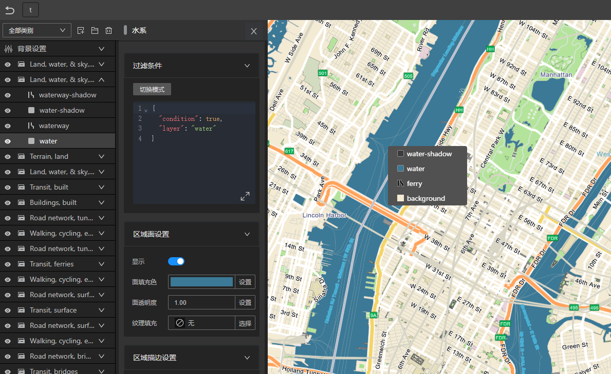
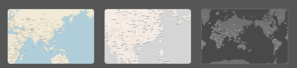

# 简介

## 什么是 MapTalks Designer

Designer是一款所见即所得的矢量瓦片样式设计软件，您可以通过它连接各类矢量瓦片数据源，快速设计并导出样式给maptalks引擎加载。

Designer服务地址： https://designer.maptalks.com

## 为什么采用Designer？

[矢量瓦片格式](../studio/basic/vt)实现了地图数据与样式的分离，矢量瓦片的渲染是通过引擎根据样式定义对数据的实时处理与渲染，一方面数据制备流程明显简化，另一方面也能根据需求对同一份地图数据根据需求定义不同的样式。

通过Designer，就可以给任意的矢量瓦片数据源用所见即所得的方式配置地图样式，导出后通过maptalks.js加载渲染。

## 数据源
Designer支持的矢量瓦片数据源：

* [GeoServer vector-tiles 扩展](datasources/geoserver)生成的矢量瓦片服务
* 采用标准矢量瓦片格式的互联网地图服务，例如 [mapbox](https://mapbox.com) 和 [maptiler](https://maptiler.com)

## 地理投影
Designer支持以下几种常用地理投影：
* 3857投影
* 4326投影
* 4490投影

## 瓦片组织方式

Designer支持的瓦片组织方式：
* XYZ规则，互联网地图服务中的流行方式，例如mapbox，maptiler，osm等
* tms规则，osgeo标准中的瓦片组织方式，常见于GeoServer或其他遵从OGC标准的数据服务

